# HiBlock区块链社区线下沙龙汇总

[HiBlock社区线下活动一览](http://hiblock.huodongxing.com/)

## 重点活动  

** 近期重点推荐活动 **

- [成都黑客马拉松 9.14-9.16](http://www.huodongxing.com/event/7454115185411)
- HiBlock线下沙龙其他城市正在积极筹备中  
- 欢迎[报名当地组织者](https://github.com/HiBlock/hiblock/issues/new?title=报名HiBlock线下沙龙组织者&body=-姓名：%0A-城市：%0A-我的特长是：%0A-为什么要申请组织者：%0A)  

## 完成  
- [Blockathon Global Tour Beijing 黑客马拉松](http://t.cn/RuceCUl)
- [所有活动录像 - sponsored by IT大咖说](http://www.itdks.com/member/organizer/497)
- HiBlock线下沙龙001 北京4月7日 -- [活动介绍](http://t.cn/RmvNvQC) | [活动报道1](https://mp.weixin.qq.com/s/O07F-ChvBSx6um4iw39qOw)  
- HiBlock线下沙龙002 -- [杭州4月22日活动介绍](http://t.cn/Rm6XbHB)
- HiBlock线下沙龙003 -- [北京4月22日活动介绍](http://www.huodongxing.com/event/3435955404500)
- HiBlock线下沙龙004 -- [西安4月22日活动介绍](http://www.huodongxing.com/event/5435676971800)
- HiBlock线下沙龙005 -- 北京线下一起写代码
- HiBlock线下沙龙006 -- [北京5月13日活动介绍](http://www.huodongxing.com/event/2438909312000)
- HiBlock线下沙龙007 -- [上海5月19日活动介绍](http://www.huodongxing.com/event/6440024423700)
- HiBlock线下沙龙008 -- [西安5月27日活动介绍](http://www.huodongxing.com/event/6440193405000)
- HiBlock线下沙龙009 -- [天津6月2日活动介绍](http://t.cn/R3g1IHu)
- HiBlock线下沙龙010 -- [成都6月10日活动介绍](http://www.huodongxing.com/event/1442435371000)
- HiBlock线下沙龙011 -- [上海6月13日活动介绍](http://www.huodongxing.com/event/1443667029900)
- HiBlock线下沙龙012 -- [上海6月20日活动介绍](http://www.huodongxing.com/event/4444309566400)
- HiBlock线下沙龙013 -- [深圳6月23日活动介绍](http://www.huodongxing.com/event/2444156140600)
- HiBlock线下沙龙014 -- [西安6月23日活动介绍](http://www.huodongxing.com/event/5444140630400)
- HiBlock线下沙龙015 -- [重庆6月23日活动介绍](http://www.huodongxing.com/event/1444184588000)
- HiBlock线下沙龙016 -- [南京6月30日活动介绍](http://www.huodongxing.com/event/8445373205400)
- HiBlock线下沙龙017 -- [上海7月4日活动介绍](http://www.huodongxing.com/event/6445591029300)
- HiBlock线下沙龙018 -- [北京7月15日活动介绍](http://www.huodongxing.com/event/5446639370200)
- HiBlock线下沙龙019 -- [上海7月11日活动介绍](http://www.huodongxing.com/event/7446644042511)
- HiBlock线下沙龙020 -- [上海7月18日活动介绍](http://www.huodongxing.com/event/3447213980300)
- HiBlock线下沙龙021 -- 上海7月25日活动介绍
- HiBlock线下沙龙022 -- 成都7月28日活动介绍
- HiBlock线下沙龙023 -- 上海8月1日活动介绍
- HiBlock线下沙龙024 -- 上海8月8日活动介绍
- HiBlock线下沙龙025 -- 上海8月15日活动介绍
- HiBlock线下沙龙026 -- 深圳8月15日活动介绍
- HiBlock线下沙龙027 -- 上海8月22日活动介绍
- HiBlock线下沙龙028 -- 西安8月25日活动介绍
- HiBlock线下沙龙029 -- 北京8月25日活动介绍
- HiBlock线下沙龙030 -- 上海8月29日活动介绍
- HiBlock线下沙龙031 -- 深圳9月2日活动介绍
- [成都黑客马拉松 9.14-9.16](http://www.huodongxing.com/event/7454115185411)
- HiBlock线下沙龙032 -- 成都9月7日活动介绍
- HiBlock线下沙龙033 -- 上海9月12日活动介绍
- HiBlock线下沙龙034 -- 上海9月19日活动介绍

## 社区需要你  
- 技术布道者：要求，1. 对区块链技术有热情； 2. 对技术布道有热情； 3. 请参考1和2  
- 联系方式：bob@hiblock.net  

## HiBlock支持
- 图书
- X展架
- 横幅
- 宣传彩页
- 活动前海报设计 （需要当地负责人提供信息，包括话题主题、简介、收益、讲师姓名、讲师照片）
- 活动后的文字整理 （需要当地负责人现场录音及分享PPT）

## 市场材料下载  
链接:https://pan.baidu.com/s/1daDArseeUi6vGz6LpyYLhg 密码:nqy3

## HiBlock介绍
HiBlock 秉承开放、协作、透明、链接、分享的价值观，致力打造一个专注于区块链的开发者社区，我们不仅在开发者中宣传推广区块链，还会帮助开发者真正掌握区块链技术和应用。我们有线上活动（如一起译文档、一起学以太坊、一起学EOS等），有培训课程（提供专业的区块链技术培训 http://hiblock.net/topics/node16 ）、也有线下沙龙聚会（全国各城进行线下交流），还有blockathon（链接全球区块链开发者）。详情参考：https://github.com/HiBlock/hiblock/tree/master/meetup 

## 合作伙伴（Partner）
- [Brahma OS](https://www.brahmaos.io/)  
- [Olympus Labs](https://olympuslabs.io/)  
- 申请成为合作伙伴，联系： bob@hiblock.net

## 活动合影记录

时间			|	地点				|	合影									|	下载PPT
------		|--------			|---------								| ---------
2018.6.23	|深圳 				| 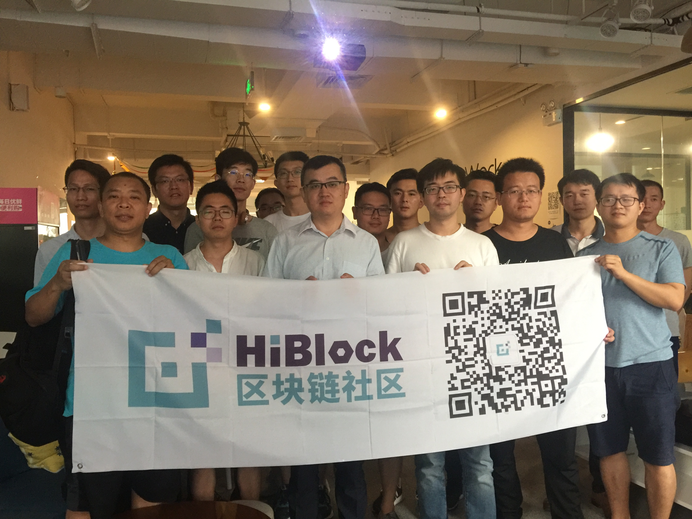	|
2018.6.23	|西安 				| 	|
2018.6.10	|成都 				| 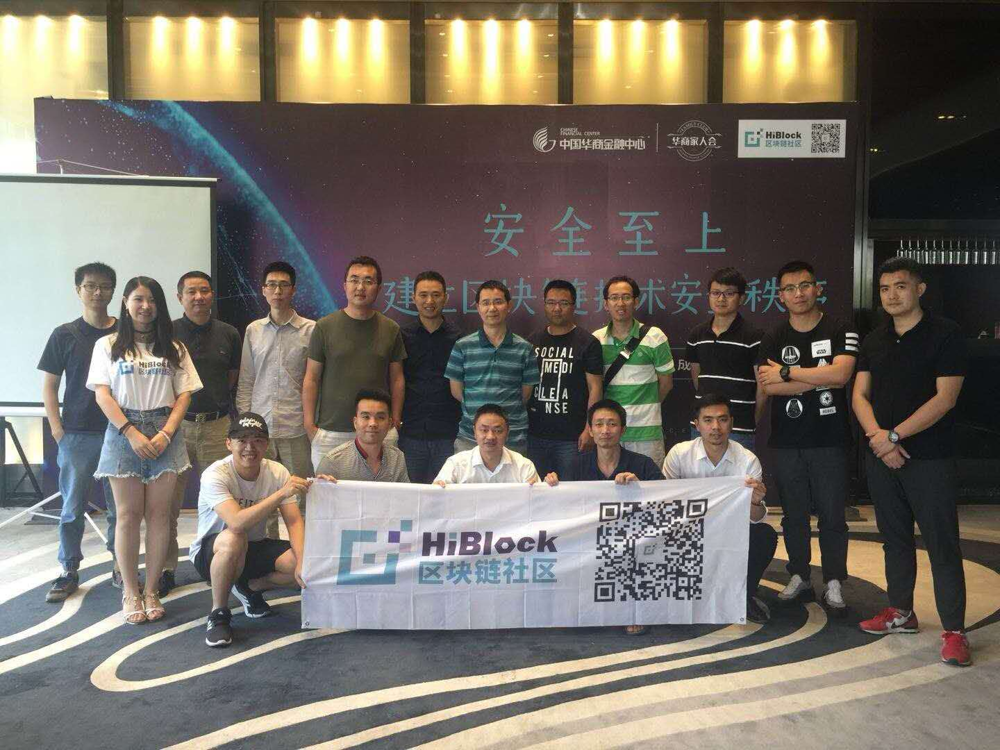	|
2018.6.2	|天津 				| 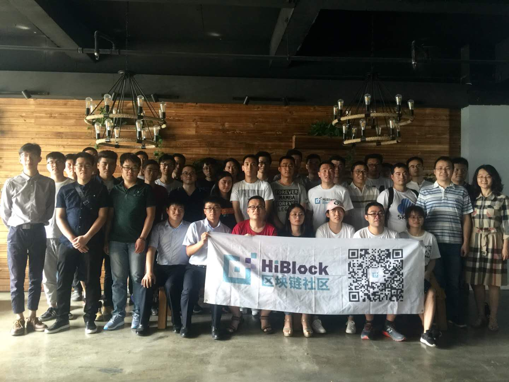	|
2018.5.27	|西安 				| 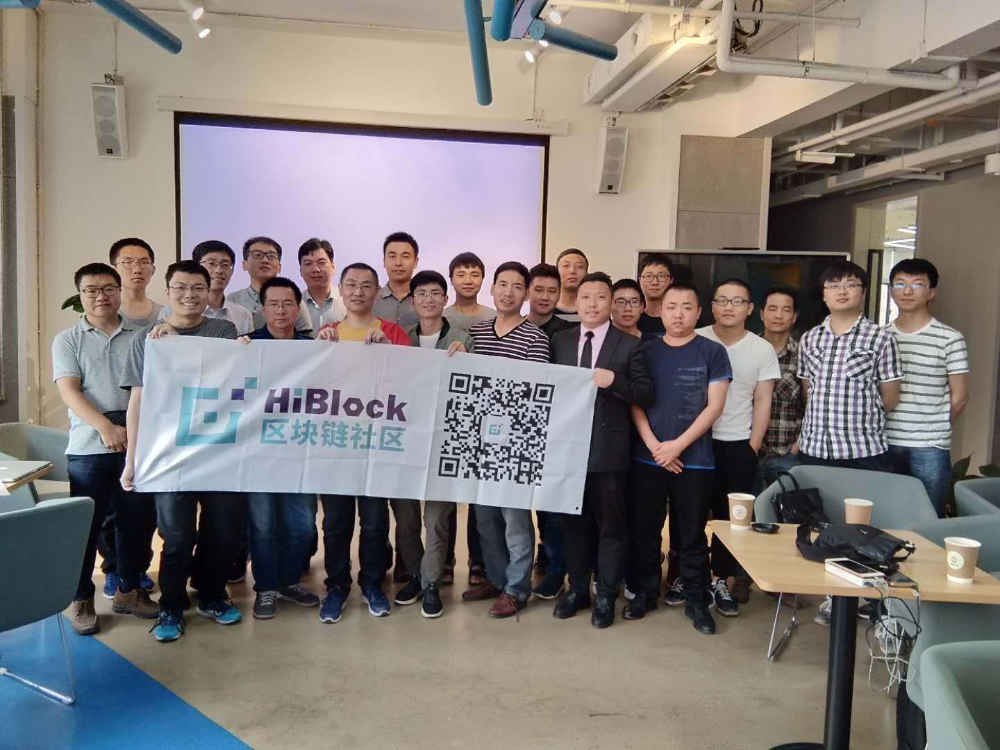	| [下载](https://github.com/HiBlock/hiblock/tree/master/meetup/slides/20180527-xian)
2018.5.19	|上海 				| 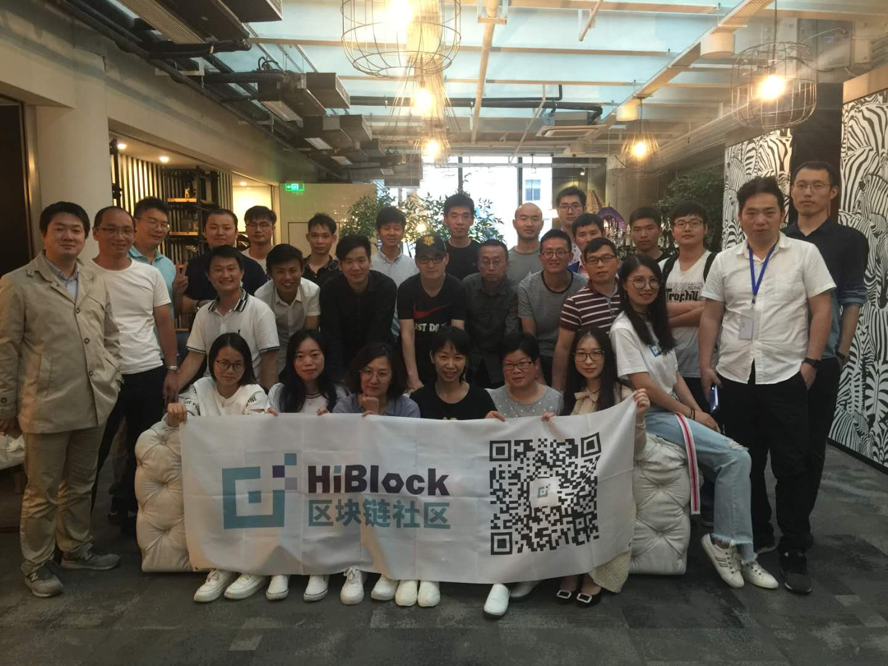	| [下载](https://github.com/HiBlock/hiblock/tree/master/meetup/slides/20180519-shanghai)
2018.5.13	|北京 				| 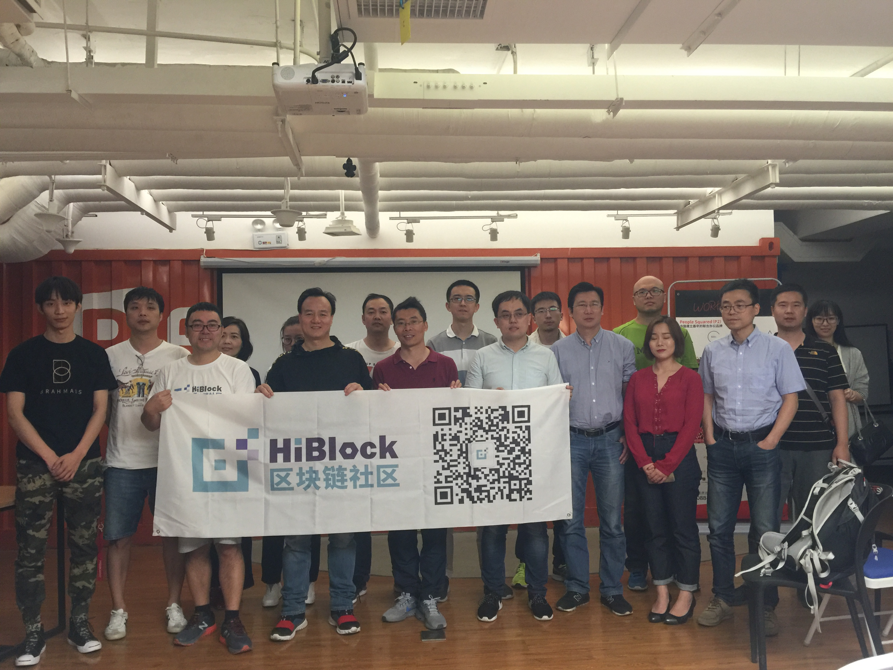	| [下载](https://github.com/HiBlock/hiblock/tree/master/meetup/slides/20180513-beijing)
2018.4.28	|北京 				| 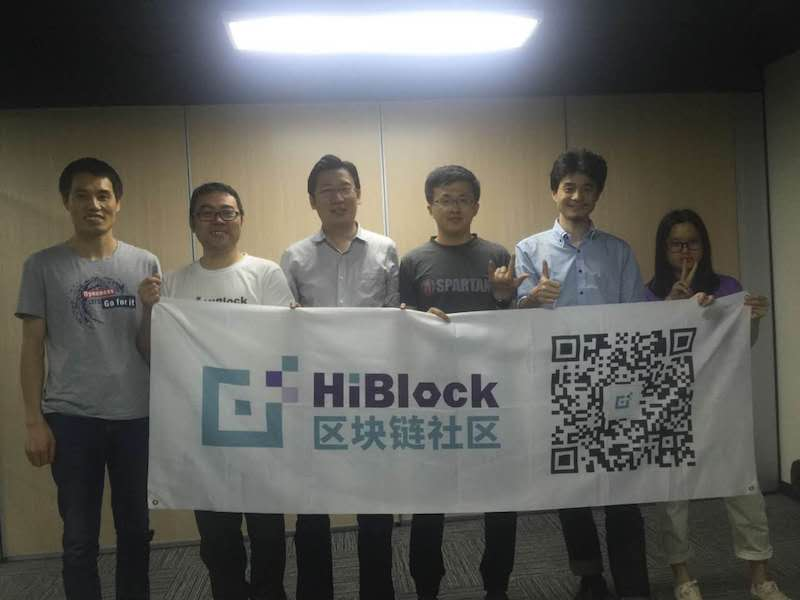	| [参考资料](https://github.com/etherchina/ethereum/blob/develop/petstore-truffle.md)
2018.4.22	|杭州 				| 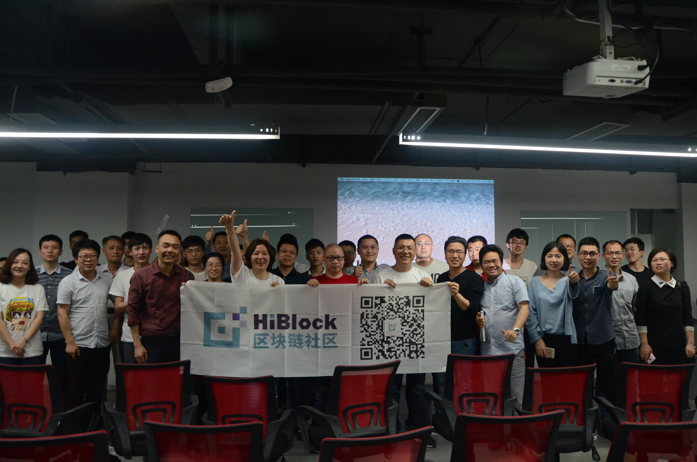	| 无
2018.4.22	|西安 				| 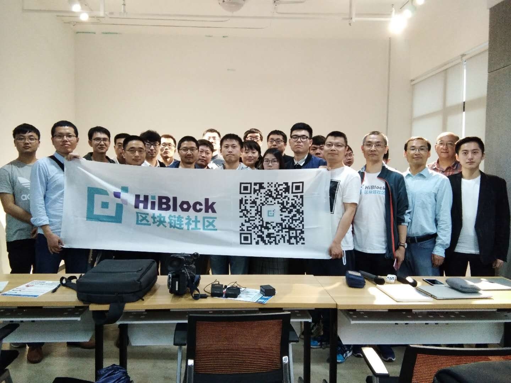	| [下载](https://github.com/HiBlock/hiblock/tree/master/meetup/slides/20180422-xian)
2018.4.22	|北京 				| 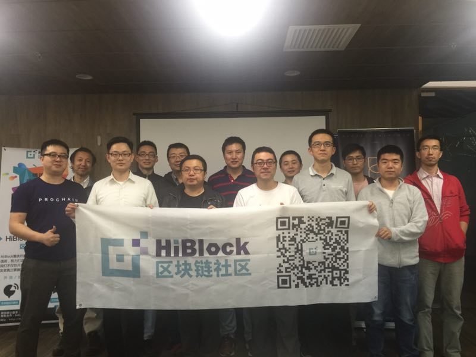	| [下载](https://github.com/HiBlock/hiblock/tree/master/meetup/slides/20180422-beijing)
2018.4.7	|北京 				| 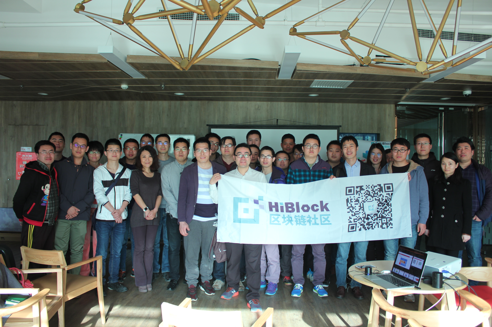	| [下载](https://github.com/HiBlock/hiblock/tree/master/meetup/slides/20180407-beijing)
