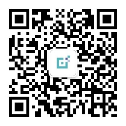

# 本周汇总20180408  

## 本周推荐文章
[用以太坊开发框架Truffle开发智能合约实践](http://mp.weixin.qq.com/s/QF6NYqlKAKDJnZHsA0UNlw)  

## 线下meetup
- HiBlock线下001-- [4月7日北京](http://t.cn/RmvNvQC)   
- 4月22日 北京 筹备中  
- 西安、上海、杭州、厦门、大连、重庆、成都正在积极筹备中  
- 如果你想组织当地的区块链meetup，可以[点击这里](https://github.com/HiBlock/hiblock/blob/master/hiblock-china.md)  

## 用户数  
- 公众号粉丝新增(hiblock-net)：94 ，当前总数：2454
- Twitter粉丝新增（@HiBlock_Net）：3，当前总数：12

## 翻译  
1. Solidity文档翻译  
	完成进度https://github.com/etherchina/solidity-doc-cn/     
2. [Blockathon翻译](https://github.com/HiBlock/Blockathon-CN)  

## 课程
- 区块链技术概念及智能合约实践: https://m.qlchat.com/live/channel/channelPage/2000000849256491.htm  
- 超级账本开发实践分享： https://m.qlchat.com/wechat/page/topic-intro?topicId=2000001036300891&preview=Y&intoPreview=Y

## 杂项
1. [HiBlock线下沙龙活动清单](https://github.com/HiBlock/hiblock/blob/master/hiblock-china.md) 

## 社区需要你  
- 技术布道者：要求，1. 对区块链技术有热情； 2. 对技术布道有热情； 3. 请参考1和2  
- 联系方式：bob@hiblock.net   

## HiBlock介绍
HiBlock 秉承开放、协作、透明、链接、分享的价值观，致力打造一个专注于区块链的开发者社区，我们不仅在开发者中宣传推广区块链，还会帮助开发者真正掌握区块链技术和应用。  

## 合作伙伴（Partner）
- [Brahma OS](https://www.brahmaos.io/)  
- [Olympus Labs](https://olympuslabs.io/)  
- 申请成为合作伙伴，联系： bob@hiblock.net

## 关注HiBlock

扫码关注微信公众号（HiBlock-Net）    |  扫码关注Twitter（HiBlock_Net）  
-------------------------       |----------------
  |  

